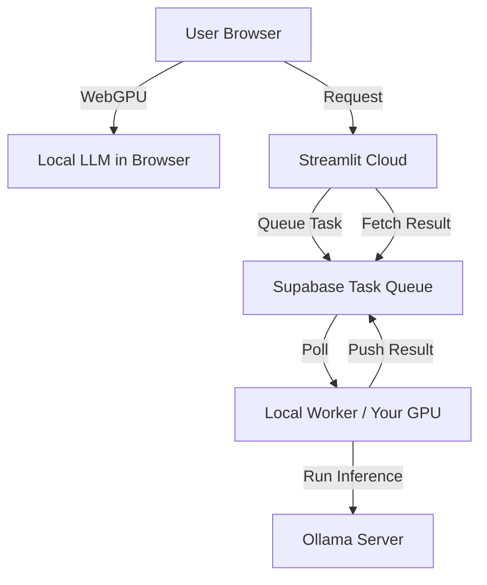

# ⚖️ RATIO - The Ratiocination Arena

[](https://ratiotrillm.streamlit.app/)
[](https://opensource.org/licenses/MIT)

**Zero-Cost, Cloudless AI Debate Engine.**

RATIO is a high-performance debate orchestration platform that runs entirely for free by leveraging:
- **Streamlit Cloud** for global accessibility.
- **Supabase** for a secure, zero-latency task queue.
- **Local GPUs (Ollama)** for private, zero-cost inference.
- **WebGPU (Browser Inference)** for decentralized intelligence.

---

## 🚀 Live Demo: [ratiotrillm.streamlit.app](https://ratiotrillm.streamlit.app/)

---

## 🏗️ Technical Architecture

RATIO uses a **Hybrid Cloud-Local** model to eliminate API costs:



---

## 📦 Features

- **⚡ Edge Mode**: Run Llama 3.2 directly in your browser via WebGPU. $0 cost, 100% privacy.
- **⚔️ Battle Arena**: Multi-round debates with intelligent judging.
- **🎬 Live Gallery**: Persistent archive of every intelligence battle.
- **📊 Leaderboards**: Track which models (Llama 3.1 vs 3.2) are dominating.

## Architecture


```
┌─────────────────────┐
│   Streamlit UI      │  Web Interface
│   (Port 8501)       │
└──────────┬──────────┘
           │
┌──────────┴──────────┐
│   FastAPI Server    │  REST API
│   (Port 8000)       │
└──────────┬──────────┘
           │
┌──────────┴──────────┐
│  Debate Engine      │  Orchestration
│  (Parallel + Retry) │
└──────────┬──────────┘
           │
┌──────────┴──────────┐
│  Ollama Server      │  LLM Backend
│  (Port 11434)       │
└─────────────────────┘
```

## Prerequisites

- **Docker & Docker Compose** (recommended)
- **Python 3.11+** (for local development)
- **Ollama** with LLaMA 3.2, Qwen 3 VL 4B, and LLaMA 3.1 8B models installed
- **4GB+ RAM** recommended
- **GPU Support** (Optional): NVIDIA GPU with CUDA drivers and NVIDIA Docker Runtime

## ⚠️ Important: Ollama Setup Required

The debate engine requires **Ollama** to be running. Without it, debates will fail.

### Quick Ollama Setup (3 minutes)

```bash
# 1. Download Ollama from https://ollama.ai
# 2. Start Ollama service
ollama serve

# 3. In another terminal, pull required models
ollama pull llama3.2      # Model A
ollama pull qwen3-vl:4b   # Model B
ollama pull llama3.1:8b   # Judge

# 4. Verify models are ready
curl http://localhost:11434/api/tags
```

**After this, your debates will work!** ✅

### Model Configuration (Optional)

You can override model IDs and display names without code changes:

```bash
export MODEL_A_ID="llama3.2"
export MODEL_B_ID="qwen3-vl:4b"
export JUDGE_MODEL_ID="llama3.1:8b"
export MODEL_A_LABEL="LLaMA 3.2"
export MODEL_B_LABEL="Qwen 3 VL 4B"
export JUDGE_LABEL="LLaMA 3.1 8B"
```

### For Docker Users

If running the app in Docker, ensure Ollama is accessible:
- **Option A** (Recommended): Run Ollama on host, app in Docker
  ```bash
  # Add to .env file:
  OLLAMA_URL=http://host.docker.internal:11434  # macOS/Windows
  # or
  OLLAMA_URL=http://172.17.0.1:11434           # Linux
  ```

- **Option B**: Run Ollama in Docker too
  - See `docker-compose.yml` for a complete example with Ollama service

**See [OLLAMA_SETUP.md](OLLAMA_SETUP.md) for detailed troubleshooting and configuration.**

## Quick Start

### Option 1: Docker Compose (Recommended)

```bash
# Clone and navigate to project
cd debate\ ai

# Start all services
docker-compose up -d

# Wait for services to be healthy (~1-2 minutes)
docker-compose ps

# Access the application
# - Web UI: http://localhost:8501
# - API: http://localhost:8000
# - API Docs: http://localhost:8000/api/docs
```

### Option 1B: Docker Compose with GPU Support

```bash
# Requirements: NVIDIA GPU + nvidia-docker runtime

# Start with GPU acceleration
docker-compose -f docker-compose.gpu.yml up -d

# Access the application (same URLs as above)
```

### Option 2: Local Development

```bash
# Install dependencies
pip install -r requirements.txt

# Start Ollama (in separate terminal)
ollama serve

# Pull required models
ollama pull llama3.2
ollama pull qwen3-vl:4b
ollama pull llama3.1:8b

# Run API server (in separate terminal)
uvicorn trillm_arena.api_updated:app --reload --port 8000

# Run Streamlit UI (in another terminal)
streamlit run trillm_arena/app_updated.py
```

## API Usage

### Health Check

```bash
curl http://localhost:8000/health
```

### Run a Debate

```bash
curl -X POST "http://localhost:8000/debate" \
  -H "Content-Type: application/json" \
  -d '{
    "topic": "Should AI regulation be government-led or industry-led?",
    "deep_review": false
  }'
```

### Response Format

```json
{
  "model_a": {
    "opening": "...",
    "rebuttal": "...",
    "defense": "..."
  },
  "model_b": {
    "opening": "...",
    "rebuttal": "...",
    "defense": "..."
  },
  "fast_verdict": "{\"winner\": \"Model A\", ...}",
  "heavy_verdict": null,
  "meta": {
    "auto_heavy_judge": false,
    "manual_deep_review": false,
    "topic": "..."
  }
}
```

## Configuration

### Environment Variables

Edit `.env` file (copy from `.env.example`):

```bash
cp .env.example .env
```

Key variables:
- `OLLAMA_URL`: Ollama API endpoint
- `DEBATE_TIMEOUT`: Timeout for debate execution (seconds)
- `MAX_WORKERS`: Parallel execution workers
- `MODEL_A`, `MODEL_B`: Debate models
- `FAST_JUDGE`, `HEAVY_JUDGE`: Judge models

## Project Structure

```
debate ai/
├── trillm_arena/
│   ├── __init__.py              # Package initialization
│   ├── debate_engine.py         # Core debate orchestration
│   ├── llm.py                   # LLM interface with retries
│   ├── prompts.py               # Debate prompt templates
│   ├── api_updated.py           # FastAPI server
│   └── app_updated.py           # Streamlit web interface
├── requirements.txt             # Python dependencies
├── Dockerfile                   # Multi-stage Docker build
├── docker-compose.yml           # Docker Compose orchestration
├── .env.example                 # Environment template
└── README.md                    # This file
```

## Production Deployment

### AWS ECS

```bash
# Build image
docker build -t trillm-arena:latest .

# Push to ECR
aws ecr get-login-password --region us-east-1 | docker login --username AWS --password-stdin <your-ecr-uri>
docker tag trillm-arena:latest <your-ecr-uri>/trillm-arena:latest
docker push <your-ecr-uri>/trillm-arena:latest

# Update ECS service with new image
```

### Kubernetes

```bash
# Create namespace
kubectl create namespace trillm

# Apply manifests
kubectl apply -f k8s/ -n trillm

# Check status
kubectl get pods -n trillm
```

### AWS Lambda (API only)

Use AWS Lambda container images with the FastAPI server.

## Monitoring & Logging

### Docker Logs

```bash
# API logs
docker logs trillm-api -f

# UI logs
docker logs trillm-ui -f

# Ollama logs
docker logs trillm-ollama -f
```

### Health Checks

```bash
# API health
curl http://localhost:8000/health

# UI health
curl http://localhost:8501/_stcore/health
```

## Performance Optimization

1. **Parallel Execution**: Debate rounds run in parallel (4 workers default)
2. **Caching**: Docker layer caching for faster builds
3. **Streaming**: Streamlit app supports real-time updates
4. **Retry Logic**: Automatic retries for transient failures
5. **Timeouts**: Configurable timeouts prevent hanging

## Error Handling

- **Input Validation**: Validates topic length and format
- **LLM Retries**: Automatic retries with exponential backoff
- **Timeout Protection**: Debates abort after configured timeout
- **Graceful Degradation**: Heavy judge failures don't block results
- **Detailed Logging**: All errors logged for debugging

## Security Considerations

1. **CORS**: Configured for all origins (restrict in production)
2. **Input Validation**: Pydantic models validate all inputs
3. **Timeout Protection**: Prevents resource exhaustion
4. **Logging**: Sensitive data not logged
5. **Container Security**: Non-root user recommended

## Troubleshooting

### Ollama Connection Issues
```bash
# Test Ollama connectivity
curl http://localhost:11434/api/tags

# Ensure Ollama models are pulled
ollama pull llama3.2
ollama pull qwen3-vl:4b
ollama pull llama3.1:8b
```

### Slow Performance
- Increase `MAX_WORKERS` in `.env`
- Ensure sufficient RAM (4GB minimum)
- Check CPU availability
- Monitor network latency to Ollama

### API Returns 500 Error
- Check Ollama is running: `curl http://localhost:11434/api/tags`
- Check logs: `docker logs trillm-api`
- Ensure models are pulled

## Development

### Running Tests

```bash
pytest tests/ -v
```

### Code Quality

```bash
# Lint
pylint trillm_arena/

# Format
black trillm_arena/

# Type checking
mypy trillm_arena/
```

## Contributing

1. Fork the repository
2. Create a feature branch
3. Commit changes
4. Push to branch
5. Create Pull Request

## License

MIT License - See LICENSE file for details

## Support

- **Issues**: Create GitHub issues for bugs/features
- **Discussions**: Use GitHub discussions for questions
- **Documentation**: Check README and inline code comments

## Changelog

### v1.0.0 (2024-02-08)
- Initial production release
- FastAPI server with OpenAPI docs
- Streamlit web interface
- Docker/Docker Compose support
- Comprehensive logging and error handling
- Auto-trigger heavy judge for close debates

## GPU Setup & Configuration

### Prerequisites for GPU Support

```bash
# 1. Install NVIDIA Docker Runtime
docker run --rm --runtime=nvidia --gpus all nvidia/cuda:12.0-base-ubuntu22.04 nvidia-smi

# 2. Verify NVIDIA support
nvidia-smi  # Should display GPU information

# 3. Docker configuration
# GPU support should be available after nvidia-docker installation
```

### Using GPU-Accelerated Setup

```bash
# Start with GPU support
docker-compose -f docker-compose.gpu.yml up -d

# Monitor GPU usage
nvidia-smi -l 1  # Updates every 1 second

# Check Ollama using GPU
docker exec trillm-ollama-gpu ollama ps
```

### Performance Comparison

| Setup | Speed | Memory | Power |
|-------|-------|--------|-------|
| CPU Only | Baseline | Lower | Lower |
| GPU (1x NVIDIA A100) | 5-10x faster | Higher | Higher |
| GPU (1x NVIDIA RTX 4080) | 3-5x faster | Medium | Medium |

### Environment Variables for GPU

```bash
# In .env
CUDA_VISIBLE_DEVICES=0  # GPU ID (0 for first GPU)
OLLAMA_DEBUG=0          # Set to 1 for debugging
```

## Roadmap

- [ ] Database integration for debate history
- [ ] Advanced analytics dashboard
- [ ] Model fine-tuning pipeline
- [ ] Distributed execution support
- [ ] WebSocket support for streaming
- [ ] Multi-language support
- [ ] Custom judge models
- [ ] Multi-GPU support
- [ ] Quantization support for smaller models


